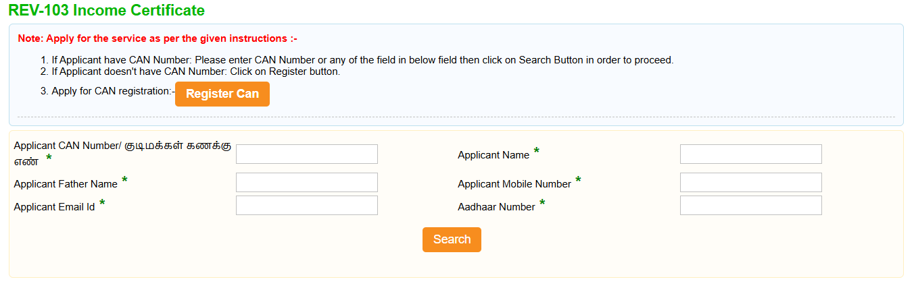

# How to Download Income Certificate Online

For students studying in schools and colleges, for competitive exam applications, for employees, and for beneficiaries of government schemes, an important document required in many areas is the **Income Certificate**.

Let's see how to apply for and obtain an Income Certificate online.

## Requirements

1. Applicant Photo
2. Any Address Proof
3. TIN Number and the Trade
4. Details of Land Holdings
5. Details of houses owned ward wise
6. Family or Smart Card
7. Self-Declaration of Applicant
8. Salary Certificate(Latest Copy)
9. PAN card

## How to Apply Online

### Step 1: Access the Portal

1. First, open the website [https://www.tnesevai.tn.gov.in/citizen/portallogin.aspx](https://www.tnesevai.tn.gov.in/citizen/portallogin.aspx)
2. On its homepage, click on **'User Login / Citizen Login'** and proceed

**For Existing Users:**
- Log in with your existing credentials

**For New Users:**
- Click on **'New User'**
- To register on the e-sevai portal, you will receive an OTP on your registered mobile number
- After registration, log in to the website

### Step 2: Select Service

1. Select **'Revenue Department'**
2. From the list, select **'REV-103 Income Certificate'**
3. Click **'Proceed'**

### Step 3: CAN Registration (If Required)

A applicant can apply for an Income Certificate if they have a unique **Citizen Access Number (CAN)**. If the applicant does not have a unique CAN number, they must register for a CAN to access the Income Certificate application form.

#### How to Register for CAN:

1. Click the **'Register CAN'** button to apply for CAN registration
2. Fill in all mandatory details in the form in the prescribed format
3. Click **'Register'** to submit the form
4. Before submitting the form, you must generate and verify an OTP
5. Upon successful CAN registration, a CAN number will be generated

### Step 4: Apply for Income Certificate

Follow the steps below to apply for an Income Certificate online:

1. Enter the CAN number and search for registrations
2. If the applicant has a unique CAN number, their registration will be displayed in the search results
3. Select the desired registration by clicking the option button next to it
4. Click **'Proceed'**

### Step 5: Fill Application Form

1. Applicant details such as current address, permanent address, and contact details will be pre-filled in the form. These details **cannot be edited**
2. Specify the details of the applicant's family members
3. For each member, specify the sources of income and the associated monthly income
4. Click the **'Add'** button to add a family member's registration
5. Click **'Submit'** to submit the form

### Step 6: Upload Documents and Payment

1. Attach documents in the recommended file size and file types
2. After uploading the documents, click **'Make Payment'**
3. After uploading everything, click **'Make payment'** and proceed
4. After clicking **'Terms and Conditions'**, click **'Make Payment'** and choose the payment method that suits you to make the payment and pay Rs.60 as the application charge.

### Step 7: Download Certificate

- Then you will be given an **Acknowledgement slip**
- Using the number on it, you can download the certificate yourself after **10 days**

---